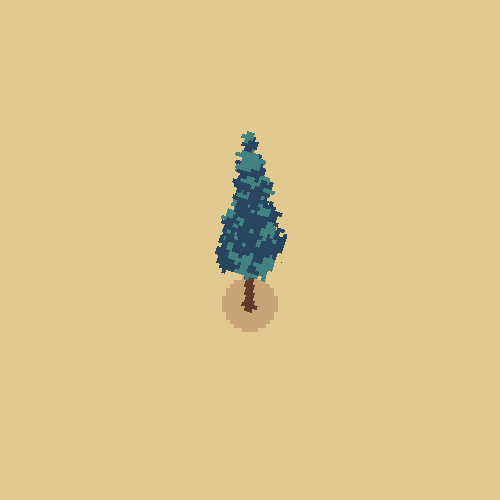
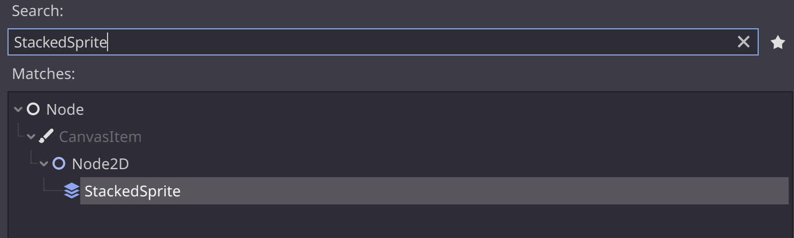

 

 

> A simple Godot addon that adds a `StackedSprite` node for quickly setting up stacked sprites.

*Stacked Sprite*: a stack of sprites layered on top of each other creating a fake  3-dimensional object.

  

**Table of Contents**
 - [Installation](#installation)
 - [Usage](#usage)
    - [Quickstart](#quickstart)
    - [Prerequisites](#prerequisites)
    - [Add StackedSprite node](#add-stackedsprite-node)
- [Credits](#credits)
- [License](#license)

# Installation

Copy the contents of `addons/stacked_sprite` into the same folder in your project, and activate it in your project settings.

Once activated the `StackedSprite` node should be accessible under the existing nodes.

# Usage

## Quickstart

A demo scene is included in this repo which includes an example stacked sprite for reference.

## Prerequisites

Create a horizontal sprite sheet that represents your stacked sprite. This sprite sheet should consist of multiple frames with each frame representing one layer in the stacked sprite, with the bottom-most sprite as the first frame.

This can be achieved with a:

- **Pixel art editor** such as [Aseprite](https://www.aseprite.org/) using the [Stacked Sprite Visualizer Plugin](https://github.com/jontopielski/aseprite-stacked-sprite-visualizer)

- **Voxel editor** like [Goxel](https://goxel.xyz/) or [MagicaVoxel](https://ephtracy.github.io/). Both these tools have an export as png slices option that exports the voxel model into the expected format.

Or, use the example pine tree sprite sheet in this repo:
[demo/pine_tree.png](demo/pine_tree.png)

## Add StackedSprite node

Add a `StackedSprite` node to your scene. 

This node has a few properties:

| **Property**   | **Description**                                                                                                        |
|----------------|------------------------------------------------------------------------------------------------------------------------|
| Texture        | The `.png` sprite sheet file representing the stacked sprite.                                                          |
| HFrames        | The Number of horizontal frames in the spreet sheet.                                                                   |
| Show Sprites   | A toggle to show the stacked sprite in the editor.                                                                     |
| Rotate Sprites | A toggle to rotate the stacked sprite in the editor.                                                                   |
| Stack Offset   | The y-position offset between each frame of the stacked sprite. Use a value greater than 1 for a more 'exploded' look. |
| Rotation Speed | Speed at which the stacked sprite rotates when `Rotate Sprites` and `Show Sprites` is enabled.                         |

# Credits

[Jon Topielski](https://twitter.com/jontopielski): For the [Stacked Sprites in Godot](https://youtu.be/_Z5eg9UvLRw?si=cpbfdlwlN89V9gII) video tutorial that this project is based on.

# License

This project is [MIT](LICENSE.md) licensed.